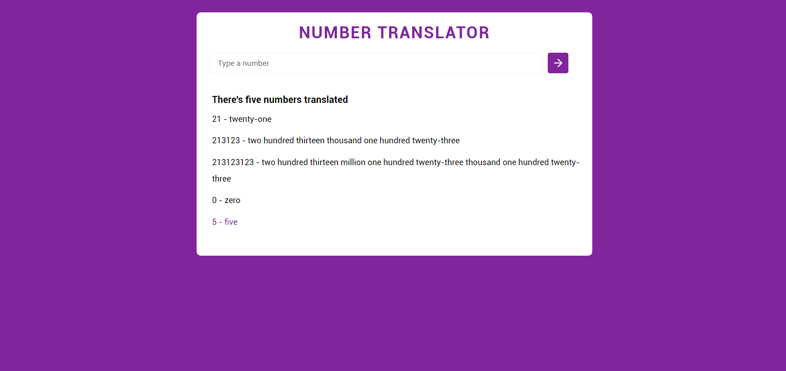

<h1 align="center">
  
<br>
Clima Agora
</h1>

<p align="center"> 🚀 A web application to translate int numbers into words</p>
<p align="center">
  <a href="https://opensource.org/licenses/MIT">
    
  </a>
</p>

## Features

- ⚛️ **React Js** — Javascript lib to create de interfaces.

## Getting started

### Frontend
To start **Frontend** using use the commands:
```bash
yarn install // or npm install
yarn start // or npm start
```
Once the process is finished, the `localhost: 3000` page will automatically open in your browser with the developed application


## License

This project is licensed by MIT License - Go to the [licence page](https://opensource.org/licenses/MIT) to see more details.
